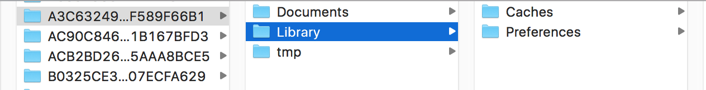

## 零碎 -- 8/30
* git 版本回退   

> git log 获取版本号  
  git reset --hard 版本号
 
* merge冲突（pod）  

> 删除冲突标记后，pod update。还是无法解决的话直接删除pod和pod.lock文件，然后pod update

* 命令

> open .   打开当前的文件夹.

* 允许Http请求

> NSAppTransportSecurity

>  

## ios文件系统 -- 8/31
### 文件夹层级  
  

 * Documents  
 
> Only documents and other data that is user-generated, or that cannot  otherwise be recreated by your application, should be stored in the <Application_Home>/Documents directory and will be automatically backed up by iCloud.  
  
* Library/Caches  
      
>   Data that can be downloaded again or regenerated should be stored >in the <Application_Home>/Library/Caches directory. Examples of files you should put in the Caches directory include database cache files and downloadable content  
     
 * Library/Preferences  
 
 * tmp  
 
> Data that is used only temporarily should be stored in the <Application_Home>/tmp directory. Although these files are not backed up to iCloud, remember to delete those files when you are done with them so that they do not continue to consume space on the user’s device.

* 总结
  
> iCloud includes Backup, which automatically backs up a user’s iOS device daily over Wi-Fi. Everything in your app’s home directory is backed up, with the exception of the application bundle itself, the caches directory, and temp directory.（除了caches，tmp，其他文件夹都会通过icloud备份。其中，document存放由用户生成，不可有app再创建的文件（例如用户写的笔记）。tmp存放临时文件，用完要删除（例如从服务器下载的图片））。 

### 获取文件夹路径  
* NSHomeDirectory()  

> 获取到的是该app的根目录,  
  /Users/xxx/Library/Developer/CoreSimulator/Devices/21726890-8224-43EF-8B25-D002B2EC979B/data/Containers/Data/Application/A3C63249-C349-4C00-AEAC-B29F589F66B1
 
 *  NSSearchPathForDirectoriesInDomains(NSDocumentDirectory, NSUserDomainMask, YES);

> 返回的是一个路径数组，但符合传入的参数条件的路径只有一个，所以数组只有一个元素。
  /Users/xxx/Library/Developer/CoreSimulator/Devices/21726890-8224-43EF-8B25-D002B2EC979B/data/Containers/Data/Application/A3C63249-C349-4C00-AEAC-B29F589F66B1/Documents  
    
> NSDocumentDirectory : Document文件夹  
  NSLibraryDirectory :   
  NSCachesDirectory  
  
### 原生对象存储到本地(NSFileManager)
### 自定义对象存储到本地（NSFileManager、NSKeyedArchiver）
  
  
  
  